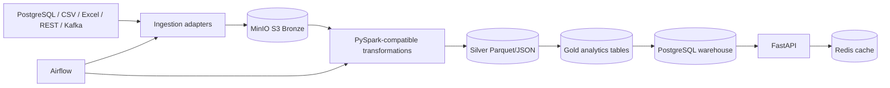

# Enterprise Retail Data Lake & Analytics Platform

A runnable, local-first retail data platform demonstrating multi-source ingestion, Bronze/Silver/Gold curation, a PostgreSQL star schema, analytics SQL, FastAPI, Redis caching, Kafka integration points, Airflow orchestration, testing, and CI.

The implementation is intentionally honest: MinIO, PostgreSQL, Redis, Kafka, Spark, Airflow, and FastAPI are wired in Docker Compose; AWS deployment, Power BI `.pbix`, and production CDC are documented extensions rather than claimed deliverables.

## Quick start

```bash
cp .env.example .env
docker compose up -d postgres redis minio
python -m scripts.generate_data
python -m scripts.run_pipeline
docker compose up -d api
curl http://localhost:8000/health
```

The local pipeline writes JSON/CSV Bronze, Silver, and Gold files under `data/lake` and can load PostgreSQL when the database is available. To start the complete environment, run `docker compose up -d`.

## Architecture



## Implemented vs optional

Implemented and tested in this repository: synthetic relational data, CSV/Excel fixture generation, file ingestion with quarantine, REST mock/client, Bronze/Silver/Gold local lake, quality checks, star-schema DDL, analytics SQL/views, FastAPI endpoints/authentication, Redis cache adapter, Kafka producer/consumer modules, Airflow DAG definition, Docker Compose, CI workflow, and unit tests.

Optional or environment-dependent: Spark execution, Kafka broker execution, Airflow scheduler execution, and PostgreSQL integration require Docker services and their images. AWS S3, CloudWatch, Power BI Desktop, and production CDC are documented but not deployed here.

## Why these technologies

- S3-compatible storage gives the lake an object-store contract locally; MinIO keeps the same API without AWS credentials.
- PySpark is the scale-out transformation target; the core transformations are also runnable in a small local mode for fast tests.
- Airflow expresses dependencies, retries, and operational ownership.
- Kafka represents append-only order events and decouples producers from consumers.
- PostgreSQL provides transactional source and analytical warehouse semantics.
- A star schema keeps BI joins predictable and makes fact grain explicit.
- Redis reduces repeated reads for hot store-sales queries.
- Docker Compose makes the integration environment reproducible.

See `docs/` for deployment, data dictionary, SIT/UAT plans, limitations, and interview preparation. See `powerbi/README.md` for import guidance.
